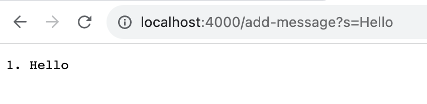
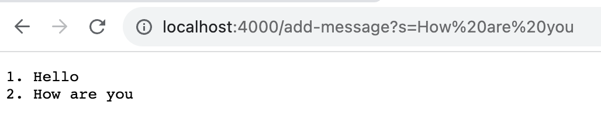

# Lab Report 2 - Servers and SSH keys

### Part 1

Code Example:
``` java
import java.io.IOException;
import java.net.URI;
import java.util.ArrayList;

class Handler implements URLHandler {
    ArrayList<String> strings = new ArrayList<String>();
    public String handleRequest(URI url) {
        if (url.getPath().equals("/")) {
            return stringFormatter();
        }
        else {
            if (url.getPath().contains("/add-message")) {
                String[] parameters = url.getQuery().split("=");
                if (parameters[0].equals("s")) {
                    String newword = parameters[1];
                    strings.add(newword);
                    return stringFormatter();
                }
            }
            return "404 Not Found!";
        }
    }
    private String stringFormatter() {
        StringBuilder builder = new StringBuilder();
        for (int i = 0, j = 1; i < strings.size(); i++, j++) {
            builder.append(j + ". " + strings.get(i) + "\n");
        }
        return builder.toString();
    }
}


class StringServer {
    public static void main(String[] args) throws IOException {
        if(args.length == 0){
            System.out.println("Missing port number! Try any number between 1024 to 49151");
            return;
        }

        int port = Integer.parseInt(args[0]);

        Server.start(port, new Handler());
    }
}
```

Screenshots of using `/add-message`:

Methods Called:
`handleRequest`, `stringFormatter`

`handleRequest` Relevant arguments: The URI named url

`stringFormatter` Relevant arguments: None

Values of field `strings`: Empty ArrayList

The value of `strings` changes in this request in that we add the string `Hello` into the `strings` arraylist.
It then proceeds that `stringFormatter`'s `StringBuilder builder` will have appended to it the `Hello` string.




Methods Called:
`handleRequest`, `stringFormatter`

`handleRequest` Relevant arguments: The URI named url

`stringFormatter` Relevant arguments: None

Values of field `strings`: `[Hello]`

The value of `strings` changes in this request in that we add the string `How are you` into the `strings` arraylist.
It then proceeds that `stringFormatter`'s `StringBuilder builder` will have appended to it the `Hello` string as well as the `How are you` string.

### Part 2:
Local path to private SSH key:
```bash
danwyl@danwyl-MBP ~ % ls .ssh/id_rsa
.ssh/id_rsa
```
Local path to public key:
```bash
[cs15lfa23rh@ieng6-201]:~:70$ ls -la .ssh/authorized_keys 
-rw-r----- 1 cs15lfa23rh ieng6_cs15lfa23 404 Oct 18 15:08 .ssh/authorized_keys
[cs15lfa23rh@ieng6-201]:~:71$ cat .ssh/authorized_keys 
ssh-rsa AAAAB...
```
Logging into `ieng6`
```bash
danwyl@danwyl-MBP ~ % ssh cs15lfa23rh@ieng6.ucsd.edu
Last login: Wed Oct 18 14:16:07 2023 from 100.81.34.52
quota: Cannot resolve mountpoint path /home/linux/staff/.snapshot/hourly.2023-10-03_0801: Stale file handle
Hello cs15lfa23rh, you are currently logged into ieng6-201.ucsd.edu

You are using 0% CPU on this system

Cluster Status 
Hostname     Time    #Users  Load  Averages  
ieng6-201   14:50:01   19  0.63,  1.85,  1.73
ieng6-202   14:50:01   12  1.51,  1.54,  1.19
ieng6-203   14:50:01   7   4.81,  4.50,  3.06

 
Wed Oct 18, 2023  2:51pm - Prepping cs15lfa23
[cs15lfa23rh@ieng6-201]:~:45$ 
```

### Part 3
One thing that I found particularly interesting is that `scp`, even with the `-p` flag, will only preserve "modification times, access times, and modes from the original file". I was curious as to how the `uid/gid` of the file were assigned, and it turns out that it takes that of the user in which you scp. That makes sense, but I also could imagine instances where you would want to preserve the file permissions and owners of the file when you copy it.
