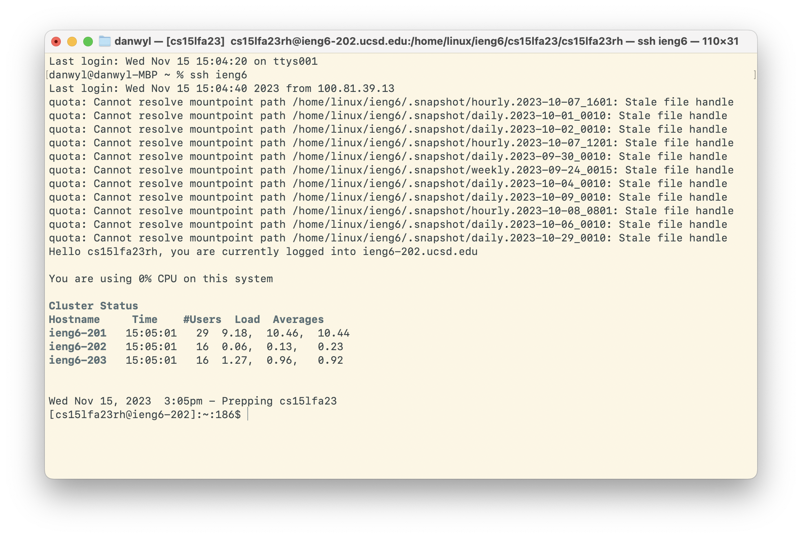
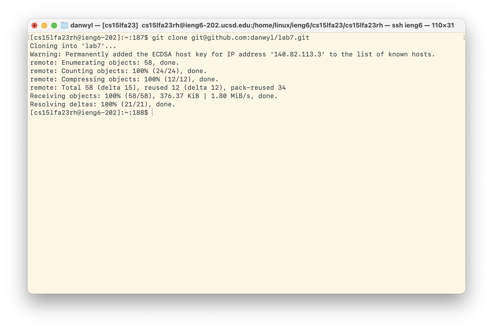
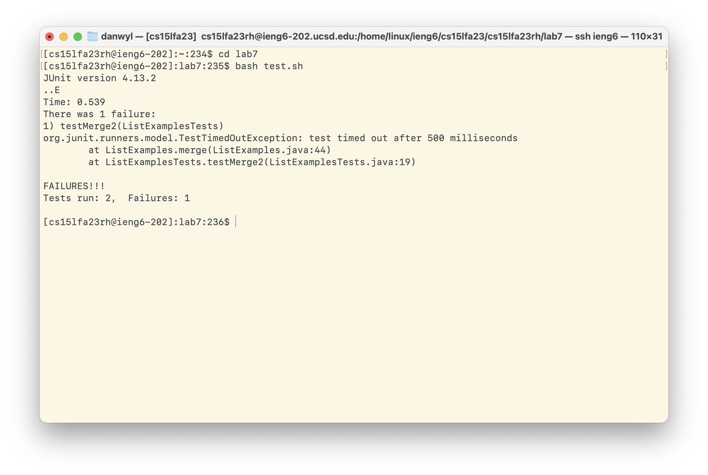
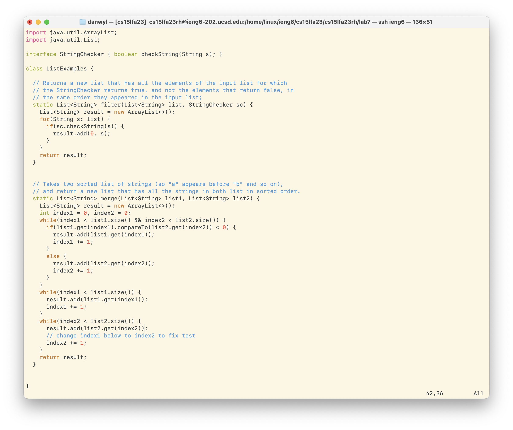
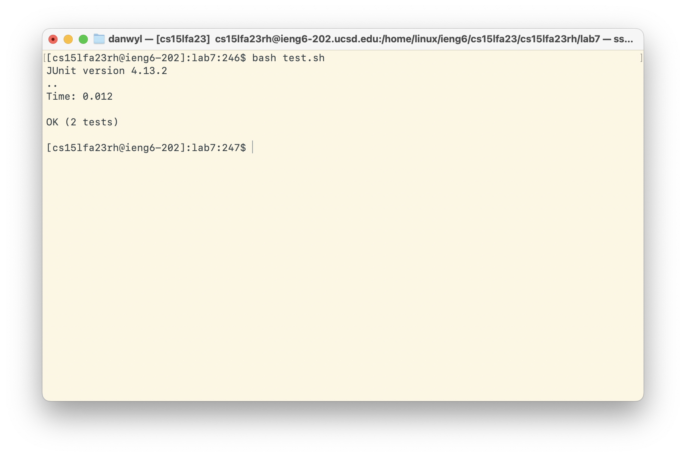
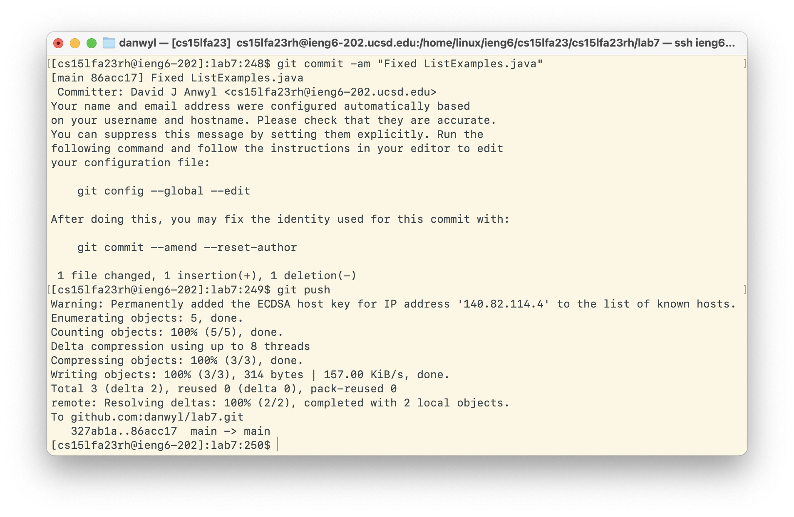

# Lab Report 4 - Doing it All from the Command Line

### 4. Log into ieng6

To do this, I typed: `ssh ieng6`

### 5. Clone your fork of the repository from your Github account

To do this, I typed: `git clone git@github.com:danwyl/lab7.git`
I was able to this because I had already previously set up the SSH key for github on the ieng6 server.

### 6. Run the tests, demonstrating that they fail

To do this, I typed: `cd lab7`, and then `bash test.sh` to run and compile the files and tests.

### 7. Edit the code file to fix the failing test

To do this, I first opened the file using `vi ListExamples.java`. Then I did `?` `i` `<enter>` `e` `r` `2` `<shift>` `z` `z`. I find the last index of i, then go to the end of the word and replace the 1 with a 2. Then I save and quit using `Shift + ZZ`. 

### 8. Run the tests, demonstrating that they now succeed

To do this, I typed: `bash test.sh` to rerun the test script.
We can now see that the tests passed.

### 9. Commit and push the resulting change to your Github account 

To do this, I typed: `git commit -am "Fixed ListExamples.java"`. Which adds and commits the untracked files. Then I typed `git push` to push the files to my repo.
