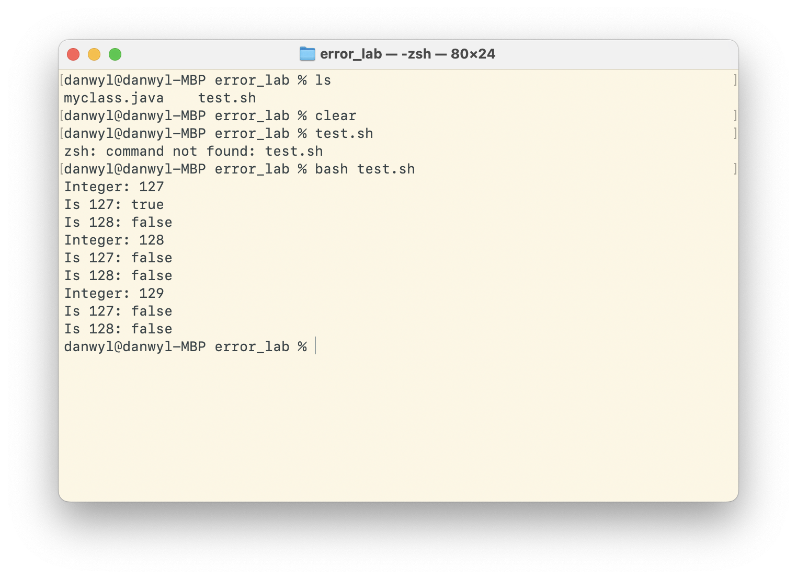
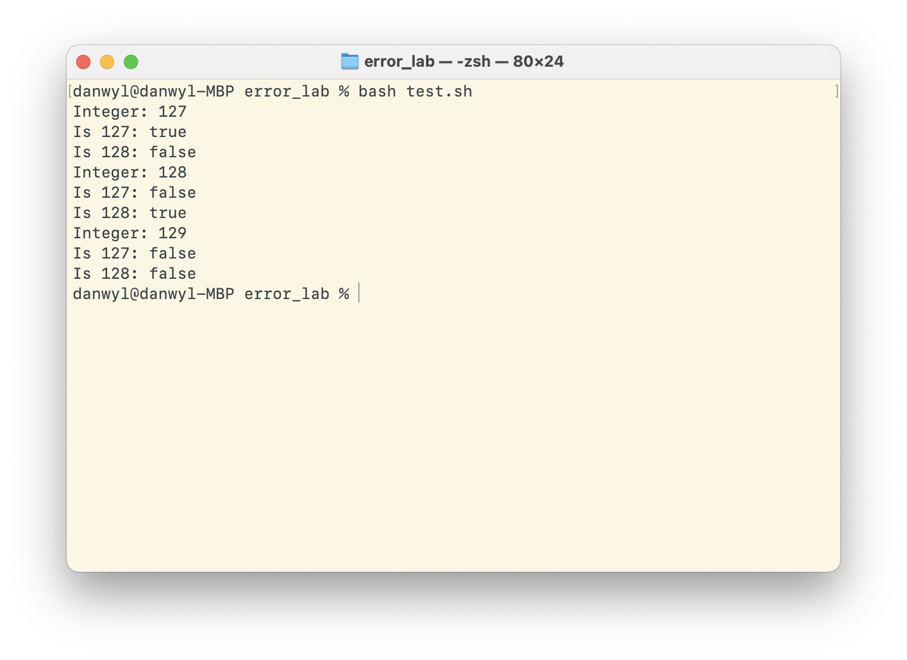

# Lab Report 5: Putting it All Together

## Part 1: Debugging Scenario

__Student:__

Hi, I'm working on a program that tells me if a number I put in as an argument is equal to 127 or 128. However, for some reason even when inputting 128 as my argument, my program says that it is not equal to 128. But this doesn't happen in the 127 case and I'm using the exact same comparison logic for it. I'm not really sure what the issue is, but I'm guessing it might have something to do with how I read in the integers from the arguments?



__TA:__

Hi Student, I have a hunch that you may be correct. How are you taking in your arguments to see if they are equal? Are they strings? Integers? ints? Each of these have their own "best practices" for checking for equality, so make sure that you are using the right tool for the job. If you're using `Integer`s, I would suggest poking around the documentation - you might find some funky behaviors with equality.

Also, I would suggest writing a test script so that you can test a whole slew of values at the same time!

__Student:__
I took your advice and made a `test.sh`, which I simply made:
```
javac *.java
java myclass 127 128 129
```
Definitely much better.

After some poking around, I found my error was where you suggested it may be. I was comparing the incoming value from `args[]` using `Integer.valueOf(args[i])`. Then, when I called both `is128` and `is127` functions, I used the equality operator of `==`. However, upon further reading it seems that since 128 falls outside of `-128, 127`, some weird behavior involving the Integer cache and pooling and the equality operator. This is why 127 worked while 128 did not. I changed to use the `.equals()`, and now my code works. Now running with my updated test script and code:



Super cool deeper dive into the inner works of Java. You really learn something new everyday. Thanks!


File Structure:
```bash
danwyl@danwyl-MBP error_lab % ls
myclass.java	test.sh
```

Original Files:

`test.sh`
```bash
javac *.java
java myclass 127 128 129
```

`myclass.java`
```java
public class myclass {

    public static boolean is128(Integer i){
        Integer compare = 128;
        return (i == compare);
        // return (i.equals(compare));
    }

    public static boolean is127(Integer i){
        Integer compare = 127;
        return(i == compare);
        // return(i.equals(compare));
    }

    public static void main(String[] args) {
        for (int i = 0; i < args.length; i++) {
            System.out.println("Integer: " + args[i]);
            System.out.println("Is 127: " + is127(Integer.valueOf(args[i])));
            System.out.println("Is 128: " + is128(Integer.valueOf(args[i])));
        }
    }
}
```

You can either run `bash test.sh` or compile and run `java myclass 128` to trigger the erroneous behavior.

This "bug" is somewhat interesting - since we are creating proper `Integer`s with autoboxing [^1] , it means that new objects are created. Thus `i` and `compare` are pointing to two different objects, which the `==` operator will see as such and return false. However, Integer creates a cache of commonly used integers, typically from `-128` to `127`, thus when creating the 127 it will simply point to that object, and thus the `==` operator will see the same object and return true.

The edits to fix the code can be seen above as comments, but more explicitly, changing from `==` to using `i.equals()` solves the problem.


## Part 2:
I was generally familiar with much of the stuff in the class, but I'd never actually used a command line debugger. Using JDB had a little bit of a learning curve, but now being able to debug from the command line versus relying on the UI of some IDE makes it much more lightweight. My only gripe with `jdb` is the lack of extensive documentation - it seems like such a powerful tool, and I really wanted to delve deeper into it but wasn't able to find documentation / posts / threads that went into enough detail for what I was looking for.

[^1]: Source https://javaconceptoftheday.com/why-128-128-returns-false-in-java/
